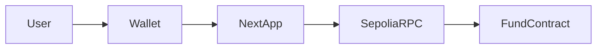

# FheloFund

FheloFund is a **wallet-first** on-chain fund demo on **Ethereum Sepolia**. Investors deposit Sepolia ETH, receive **pro-rata shares**, and can withdraw by burning shares. A designated **manager** can run **simulated P&amp;L** (`executeTrade`) that adjusts the fund’s tracked NAV for demos **without moving ETH** in that call.

The product vision in [`Proeject.md`](./Proeject.md) is **privacy-first FHE** (Fhenix / CoFHE). On **vanilla Sepolia**, the deployed contract uses **normal Solidity** — balances and events are **public** on-chain. **True confidential balances and FHE math require a Fhenix-compatible network**; this repo still ships **`@cofhe/sdk`** and a **CoFHE demo** page so you can experiment with client configuration toward that future.

---

## How it works (end-to-end)

### Roles

| Role | On-chain | In the app |
|------|-----------|------------|
| **Anyone** | Can call `deposit()` with ETH | **Invest** page sends a payable tx |
| **Investor** | `sharesOf(address)` | **Dashboard** / **Withdraw** read your shares |
| **Manager** | Only `manager` can `executeTrade` | **Manager** page enabled if your wallet matches `manager()` |
| **Owner** | `Ownable` — `setManager`, etc. | Not exposed in UI (use Etherscan or cast) |

### Deposit and shares (math)

The contract tracks `totalShares` and `totalAssetsTracked` (in wei).

1. **First depositor**  
   - `sharesMinted = msg.value`  
   - `totalShares` and `totalAssetsTracked` initialize to that amount.

2. **Later deposits**  
   - `sharesMinted = (msg.value * totalShares) / totalAssetsTracked`  
   - Then `totalShares` and `totalAssetsTracked` increase accordingly.

So each share represents a pro-rata claim on **tracked** assets.

### Withdraw

- User calls `withdraw(shareAmount)` with **share amount in wei** (integer).
- ETH out: `(shareAmount * totalAssetsTracked) / totalShares` (pro-rata).
- Shares and totals update; ETH is sent to the user.

### Manager “trade” (`executeTrade`)

- `executeTrade(int256 pnlDelta)` adjusts **`totalAssetsTracked`** by `pnlDelta` (in **wei**).
- It does **not** move ETH from the contract by itself — it simulates NAV change for demos.
- Only `manager` can call this.

### Events (Activity page)

The **Activity** tab loads `Deposit`, `Withdraw`, and `Trade` logs by calling `eth_getLogs` in **small block windows** (10 blocks per request). That matches providers such as **Alchemy’s free tier**, which reject a single `getLogs` over tens of thousands of blocks. The UI scans roughly the **latest 2,500 blocks** (see `ACTIVITY_SCAN_BLOCKS` in [`web/src/lib/get-logs-chunked.ts`](./web/src/lib/get-logs-chunked.ts)); you can raise that value if your RPC allows larger ranges. Errors are shown in plain language — raw RPC responses are never shown to users.

### Frontend stack

- **Next.js (App Router)** — server components where possible; wallet UI is client-only.
- **wagmi + viem** — reads/writes to Sepolia; chain id **11155111**.
- **TanStack Query** — caches contract reads (limited retries).
- **DotLottie** — homepage animation, **loaded with `dynamic(..., { ssr: false })`** so canvas/WebGL does not run during SSR (avoids common production crashes).

---

## Features

- **Connect wallet** via **wagmi** + **viem** (injected browser wallet, e.g. MetaMask; optional WalletConnect if `NEXT_PUBLIC_WALLETCONNECT_PROJECT_ID` is a **valid UUID** from WalletConnect Cloud).
- **Invest** — `deposit()` with ETH.
- **Withdraw** — `withdraw(shareAmount)` in share **wei** units.
- **Dashboard** — pool totals, your shares, implied ETH value, contract link.
- **Manager** — `executeTrade` for simulated P&amp;L; only manager address.
- **Activity** — recent on-chain events + Etherscan links.
- **CoFHE demo** — optional `@cofhe/sdk` config test in the browser (does not change the fund contract).

---

## Three-color UI

Palette: **background** `#0b1120`, **primary** `#2dd4bf`, **accent** `#818cf8` — see [`web/src/app/globals.css`](./web/src/app/globals.css).

---

## Deployed contract (Sepolia)

| Item | Value |
|------|--------|
| Network | Ethereum Sepolia (chain id `11155111`) |
| Contract | `0xC5f24cFe2C94384CfA37884a18e3EB8Bb0bA5771` |
| Explorer | [Sepolia Etherscan](https://sepolia.etherscan.io/address/0xC5f24cFe2C94384CfA37884a18e3EB8Bb0bA5771) |

After redeploying, update `NEXT_PUBLIC_FUND_ADDRESS` everywhere (local + Vercel) and **redeploy** the frontend.

---

## Repository layout

```
FheloFund/
  contracts/     Hardhat + Solidity (FheloFund.sol)
  web/           Next.js App Router frontend
  Proeject.md    Original product spec
  README.md      This file
```

---

## Prerequisites

- Node.js 20+
- Sepolia ETH for gas (faucet: [Sepolia faucets](https://cloud.google.com/application/web3/faucet/ethereum/sepolia) or search “Sepolia faucet”).
- **Never commit** private keys or RPC URLs that include secrets.

---

## Smart contract

```bash
cd contracts
cp .env.example .env
# Edit .env: PRIVATE_KEY, SEPOLIA_RPC_URL
npm install
npm run compile
npm test
npm run deploy:sepolia
```

Optional verification (needs `ETHERSCAN_API_KEY` in `contracts/.env`):

```bash
npx hardhat verify --network sepolia <DEPLOYED_ADDRESS> "<OWNER>" "<MANAGER>"
```

Constructor: `(initialOwner, manager)` — deploy script uses deployer for both unless `FUND_MANAGER_ADDRESS` is set.

---

## Frontend (`web/`)

```bash
cd web
cp .env.example .env.local
# Edit .env.local — see Environment variables
npm install
npm run dev
```

- **Production:** `npm run build` then `npm start`.

---

## Environment variables

| Variable | Where | Purpose |
|----------|--------|---------|
| `PRIVATE_KEY` | `contracts/.env` | Deployer key (never commit) |
| `SEPOLIA_RPC_URL` | `contracts/.env` | Sepolia HTTPS RPC for deploy |
| `NEXT_PUBLIC_SEPOLIA_RPC_URL` | `web/.env.local` / Vercel | Browser RPC; **optional** — app falls back to a public Sepolia RPC if unset |
| `NEXT_PUBLIC_FUND_ADDRESS` | `web/.env.local` / Vercel | Deployed `FheloFund` address (**required** for full UX) |
| `NEXT_PUBLIC_WALLETCONNECT_PROJECT_ID` | `web/.env.local` / Vercel | Optional; must be a **UUID** from [WalletConnect Cloud](https://cloud.walletconnect.com/). Invalid values are **ignored** so injected wallets still work |

### Vercel / production checklist

1. In **Vercel → Project → Settings → Environment Variables**, add at least:
   - `NEXT_PUBLIC_FUND_ADDRESS` = your deployed contract (checksummed or lowercase OK).
   - Optionally `NEXT_PUBLIC_SEPOLIA_RPC_URL` (recommended for reliability).
   - Optionally `NEXT_PUBLIC_WALLETCONNECT_PROJECT_ID` (valid UUID only).
2. **Redeploy** after changing `NEXT_PUBLIC_*` variables — Next.js inlines them at **build time**.
3. Open the site with **Sepolia** added in the wallet and test **Invest** on a small amount.

### Troubleshooting: “Application error: a client-side exception has occurred”

Common causes and fixes:

| Cause | Fix |
|--------|-----|
| **DotLottie / canvas** on some browsers | Fixed in this repo by loading the animation with **`next/dynamic` + `ssr: false`** on the home page. |
| **Invalid `NEXT_PUBLIC_WALLETCONNECT_PROJECT_ID`** (typo, not a UUID) | WalletConnect connector is only added if the ID matches a UUID pattern; otherwise use MetaMask. |
| **Missing `NEXT_PUBLIC_FUND_ADDRESS`** | App still runs; banner shows — set the env var and redeploy. |
| **Wrong network** | Switch wallet to **Sepolia** (chain 11155111). |
| **RPC rate limits / Alchemy `eth_getLogs` block range** | The app chunks log requests (10 blocks each). If Activity is slow, your RPC may be throttling — wait and use **Refresh**, or use a paid / higher-limit endpoint. |

If a page still errors, use **Try again** on the in-app error UI, check the **browser console**, and confirm Vercel env + redeploy.

---

## Architecture



---

## Security notes

- Treat any **posted private key** as compromised — rotate and redeploy.
- Do not commit `.env`, `.env.local`, or `PRIVATE_KEY`.

---

## License

MIT (adjust as needed for your org).

---

## Live demo

Production: [fhelo-fund.vercel.app](https://fhelo-fund.vercel.app)
