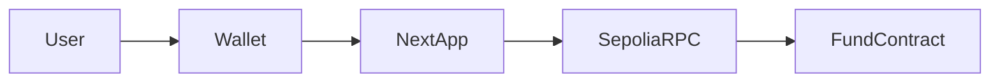

# FheloFund

FheloFund is a **wallet-first** on-chain fund demo on **Ethereum Sepolia**. Investors deposit Sepolia ETH, receive **pro-rata shares**, and can withdraw by burning shares. A designated **manager** can run **simulated P&amp;L** (`executeTrade`) that adjusts the fund’s tracked NAV for demos without moving ETH.

The product vision in [`Proeject.md`](./Proeject.md) is **privacy-first FHE** (Fhenix / CoFHE). On **vanilla Sepolia**, the deployed contract uses **normal Solidity** — balances and events are **public** on-chain. **True confidential balances and FHE math require a Fhenix-compatible network**; this repo still ships **`@cofhe/sdk`** and a **CoFHE demo** page so you can experiment with client configuration toward that future.

## Features

- **Connect wallet** via **wagmi** + **viem** (injected browser wallet, e.g. MetaMask; optional WalletConnect if `NEXT_PUBLIC_WALLETCONNECT_PROJECT_ID` is set).
- **Invest** — `deposit()` with ETH.
- **Withdraw** — `withdraw(shareAmount)` in share **wei** units.
- **Dashboard** — total shares, tracked assets, your shares, implied ETH value.
- **Manager** — `executeTrade(int256 pnlDelta)` in wei (simulated gain/loss on tracked assets); only the on-chain `manager` address can call it.
- **Activity** — recent `Deposit`, `Withdraw`, and `Trade` logs (last ~50k blocks).
- **CoFHE demo** — initialize a CoFHE config for Sepolia via `@cofhe/sdk` (does not change the transparent fund contract).

## Three-color UI

The site uses a fixed palette: **background** `#0b1120`, **primary** `#2dd4bf`, **accent** `#818cf8` (see [`web/src/app/globals.css`](./web/src/app/globals.css)).

## Deployed contract (Sepolia)

| Item        | Value |
|------------|--------|
| Network    | Ethereum Sepolia (chain id `11155111`) |
| Contract   | `0xC5f24cFe2C94384CfA37884a18e3EB8Bb0bA5771` |
| Explorer   | [Sepolia Etherscan](https://sepolia.etherscan.io/address/0xC5f24cFe2C94384CfA37884a18e3EB8Bb0bA5771) |

Re-deploying will produce a new address; update `NEXT_PUBLIC_FUND_ADDRESS` in the frontend env.

## Repository layout

```
FheloFund/
  contracts/          Hardhat + Solidity (FheloFund.sol)
  web/                Next.js App Router frontend
  Proeject.md         Original product spec
  README.md           This file
```

## Prerequisites

- Node.js 20+
- A Sepolia ETH balance on the deployer account (faucet: [Sepolia ETH](https://cloud.google.com/application/web3/faucet/ethereum/sepolia) or [sepoliafaucet.com](https://sepoliafaucet.com/)).
- **Never commit** private keys or Alchemy keys with secrets. If a key was ever shared in chat, **rotate it** and use a new deployer.

## Smart contract

```bash
cd contracts
cp .env.example .env
# Edit .env: PRIVATE_KEY, SEPOLIA_RPC_URL
npm install
npm run compile
npm test
npm run deploy:sepolia
```

Optional verification (needs `ETHERSCAN_API_KEY` in `contracts/.env`):

```bash
npx hardhat verify --network sepolia <DEPLOYED_ADDRESS> "<OWNER>" "<MANAGER>"
```

Constructor args are `(initialOwner, manager)` — the deploy script uses the deployer for both unless `FUND_MANAGER_ADDRESS` is set.

## Frontend (`web/`)

```bash
cd web
# Copy env template (Linux/macOS: cp ../.env.example .env.local)
# Windows PowerShell: Copy-Item ..\.env.example .env.local
```

Edit `web/.env.local` with at least `NEXT_PUBLIC_SEPOLIA_RPC_URL` and `NEXT_PUBLIC_FUND_ADDRESS`, then:

```bash
npm install
npm run dev
```

- **Production build:** `npm run build` then `npm start`.
- **WalletConnect:** create a project at [WalletConnect Cloud](https://cloud.walletconnect.com/) and set `NEXT_PUBLIC_WALLETCONNECT_PROJECT_ID`. Without it, **MetaMask / injected** still works.

## Environment variables

| Variable | Where | Purpose |
|----------|--------|---------|
| `PRIVATE_KEY` | `contracts/.env` | Deployer key (never commit) |
| `SEPOLIA_RPC_URL` | `contracts/.env` | Sepolia HTTPS RPC |
| `NEXT_PUBLIC_SEPOLIA_RPC_URL` | `web/.env.local` | Public RPC for the browser |
| `NEXT_PUBLIC_FUND_ADDRESS` | `web/.env.local` | Deployed `FheloFund` address |
| `NEXT_PUBLIC_WALLETCONNECT_PROJECT_ID` | `web/.env.local` | Optional WalletConnect |

## Architecture



## Security notes

- The sample **private key** must be treated as **compromised** if it was posted publicly — fund a **new** wallet and redeploy.
- Do not commit `.env`, `.env.local`, or `PRIVATE_KEY`.

## License

MIT (adjust as needed for your org).

## Live demo

Production deployment: [fhelo-fund.vercel.app](https://fhelo-fund.vercel.app)
